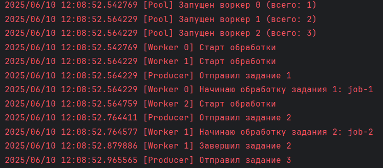

# Worker Pool на Go

Простая, но функциональная реализация пула воркеров с поддержкой динамического управления воркерами, обработки задач через каналы и graceful shutdown.

## Что реализовано

- **WorkerPool** — центральная структура, управляющая воркерами
- **Добавление и удаление воркеров:**
    - `StartWorker()` — создаёт нового воркера с уникальным ID.
    - `StopWorker(id int)` — останавливает конкретного воркера.
- **Обработка задач:**
    - Входящие задачи передаются через буферизированный канал.
    - Каждый воркер логирует свой ID и данные задачи.
- **Таймаут на выполнение задачи**, управляемый через контекст.
- **Graceful shutdown:**
    - Ожидание завершения всех активных задач.
    - Использование `context.Context` и `sync.WaitGroup`.
- **Покрытие тестами:**
    - Проверка добавления/удаления воркеров.
    - Обработка задач и поведение после остановки.
    - Тестирование таймаута задач.

## Автор
**Никита Целищев**
- Github: drtcrz23
- Telegram: @tselischevnikita

### Пример вывода
